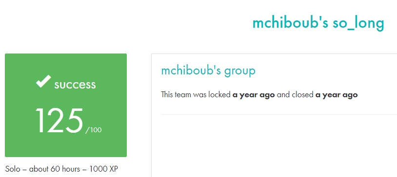

# SO_LONG #

## What the project does: ##
This project, So Long, is about creating a simple 2D game where the player collects items and navigates through a map to escape. The game involves basic movement controls, collision detection, and rendering graphics using the MiniLibX library.

## Why the project is useful: ##
This project is useful because it introduces key concepts of game development, such as texture rendering, sprite management, and event handling. It also improves your understanding of window management and basic algorithms, providing a foundation for more complex graphic programming in C.

[Subject of this project](en.subject.pdf)